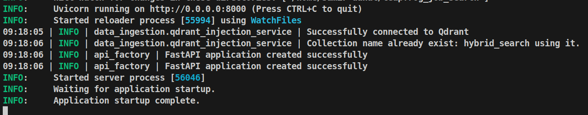
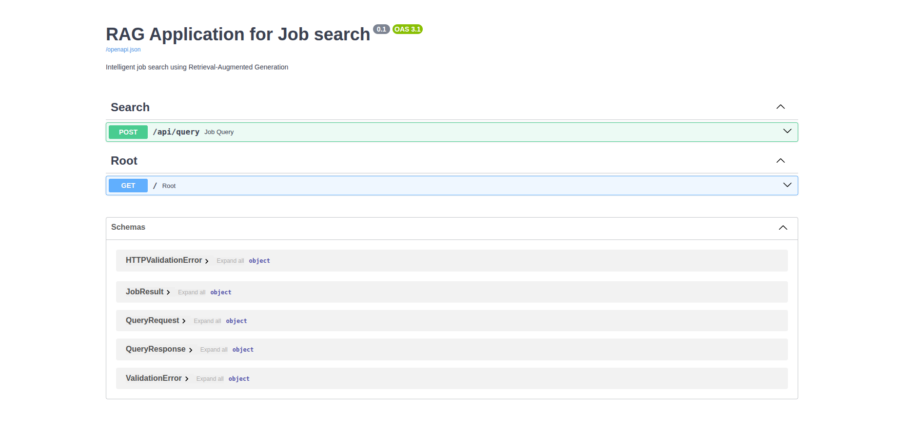
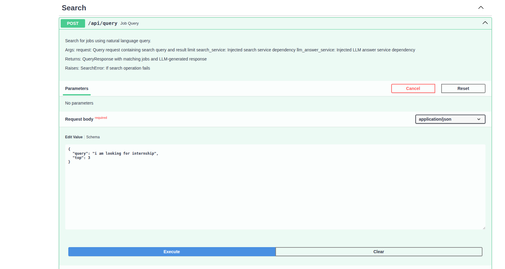
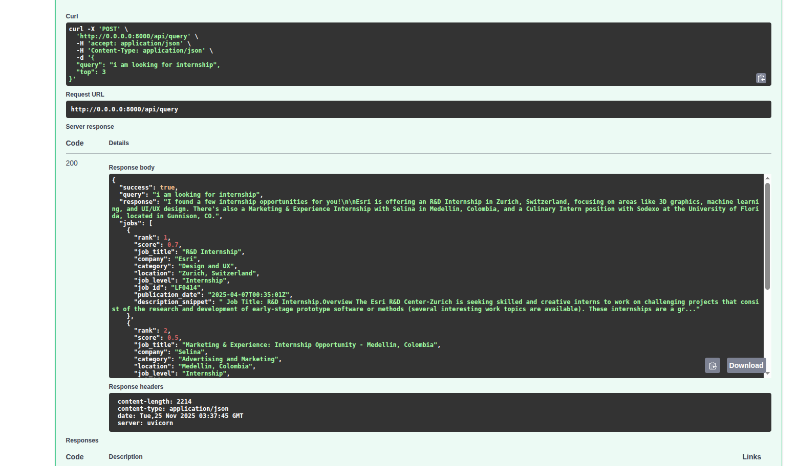
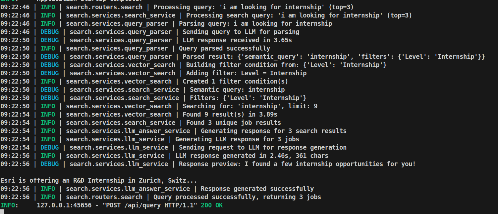

# RAG Pipeline for Job Data Retrieval

This project implements an advanced hybrid job search and retrieval system that intelligently processes natural language queries. The system combines BM25 (sparse) and semantic (dense) vector search techniques, powered by Qdrant Vector Database and Google Gemini AI. It automatically extracts search filters from user queries, performs hybrid search using Reciprocal Rank Fusion, and generates user-friendly responses in natural language.


## Key Features
- **Hybrid Search**: Combines BM25(sparse) and sentence-transformers/all-MiniLM-L6-v2(dense) vector search for accurate job retrieval. 


- **Natural Language Processing**: User can ask job-related questions in natural language and get relevant results with responses generated using Google Gemini AI.

- **Smart Filter Extraction**: 
  Automatically detects and applies filters for location,job title, job level, company, and date ranges


- **Production-Ready Architecture** : 
  Built with FastAPI, comprehensive error handling, type safety, and dependency injection

- **Intelligent Result Ranking**: 
  Uses Reciprocal Rank Fusion (RRF) to merge and rank results from multiple search methods

## Screenshots

### Application Startup


### FastAPI Swagger UI


### API Query Endpoint


### API Response


### Logging After Query Request


---


## Quick Start

### Prerequisites
- Python 3.12+
- [uv](https://docs.astral.sh/uv/) (Fast Python package manager)
- Google Gemini API Key
- Qdrant API Key and Location

### Installation & Setup

```bash
# 1. Clone repository
git clone https://github.com/samirdahal888 Job_search.git
cd Job_search

# 2. Install dependencies with uv
uv sync

# 3. Configure environment variables
cp .env.example .env
# Edit .env with your API keys:
# GEMINI_API_KEY=your_gemini_api_key_here
# QDRANT_API_KEY=your_qdrant_api_key
# QDRANT_LOCATION=https://your-cluster.qdrant.io

# 4. Initialize vector database (one-time setup)
uv run python -m data_ingestion.vector_database_setup

# 5. Run the application
uv run python main.py
```

**Access the API:**
- API: http://localhost:8000
- Interactive Docs: http://localhost:8000/docs
- Alternative Docs: http://localhost:8000/redoc

---


## Technology Stack

### Backend & API
- **[FastAPI](https://fastapi.tiangolo.com/)** - Modern, high-performance web framework for building APIs
- **[Uvicorn](https://www.uvicorn.org/)** - ASGI server for production deployment
- **[Pydantic](https://pydantic.dev/)** - Data validation and settings management

### AI & Machine Learning
- **[Google Gemini 2.5 Flash](https://ai.google.dev/gemini-api)** - LLM for query parsing and response generation
- **[Sentence Transformers](https://sbert.net/)** `all-MiniLM-L6-v2` - Dense vector embeddings (384 dimensions)
- **BM25** (via Qdrant/bm25) - Sparse vector search for keyword matching
- **Reciprocal Rank Fusion (RRF)** - Algorithm for merging hybrid search results

### Vector Database
- **[Qdrant](https://qdrant.tech/)** - High-performance vector database with FastEmbed
- **Hybrid Search** - Sparse + Dense vectors with cosine similarity
- **Field Indexing** - Optimized filtering on location, company, level, category, date

### Data Processing
- **[Pandas](https://pandas.pydata.org/)** - Data manipulation and CSV processing
- **[BeautifulSoup4](https://www.crummy.com/software/BeautifulSoup/)** - HTML cleaning from job descriptions
- **[LangChain Text Splitters](https://python.langchain.com/)** - Intelligent text chunking

### Development Tools
- **Python 3.12+** - Latest Python features and performance improvements
- **[uv](https://docs.astral.sh/uv/)** - Ultra-fast Python package manager
- **Type Hints** - Full type safety throughout the codebase
- **Structured Logging** - Colored console output with timestamps

### Architecture Patterns
- **Dependency Injection** - Clean, testable service architecture
- **Feature-Based Structure** - Modular organization (common/, data_ingestion/, search/)
- **Comprehensive Exception Handling** - Custom error hierarchy with HTTP status codes
- **Configuration Management** - Environment-based settings with Pydantic

- **Configuration Management** - Environment-based settings with Pydantic

---

## Conclusion

This Intelligent Job Search System represents a modern approach to job discovery, combining the power of AI with practical engineering solutions. By merging traditional keyword search (BM25) with semantic understanding (AI embeddings), users get the best of both worlds - precise matches and intelligent recommendations.

<!-- lets add google docs link here -->
Documentation: [Project Documentation](https://docs.google.com/document/d/1h1oOVsXOgeVSM1UQmF0EY2tjMRC5xNRdlzTpzP8_KZs/edit?usp=sharing).